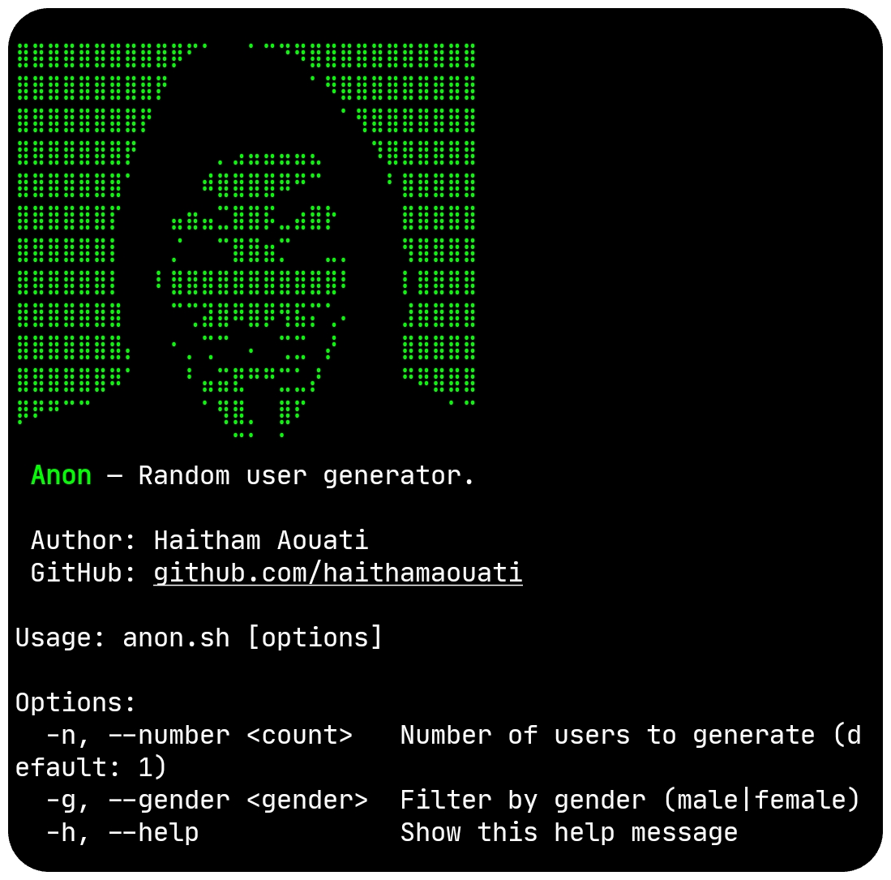

# Anon
 Anon — Random user generator.



## Install

To use the Anon script, follow these steps:

1. Clone the repository:

    ```
    git clone https://github.com/haithamaouati/Anon.git
    ```

2. Change to the Anon directory:

    ```
    cd Anon
    ```
    
3. Change the file modes
    ```
    chmod +x anon.sh
    ```
    
5. Run the script:

    ```
    ./anon.sh
    ```
## Usage

   Usage: `./anon.sh`

##### Options:

`-n`, `--number` `<count>` Number of users to generate (default: 1)

`-g`, `--gender` `<gender>` Filter by gender (male|female)

`-h`, `--help` Show this help message

##### Example:

Generate random user: `./anon.sh -n 1 -g male`

## Dependencies
The script requires the following dependencies:

- **curl**: `pkg install curl - y`
- **jq**: `pkg install jq -y`

> [!IMPORTANT]  
> Make sure to install these **dependencies** before running the script.

## Environment
- Tested on [Termux](https://termux.dev/en/)

## Disclaimer
>[!CAUTION]
>This Tool is only for educational purposes

> [!WARNING]
> We are not responsible for any misuse or damage caused by this program. use this tool at your own risk!

## License

Anon is licensed under [WTFPL license](LICENSE).
